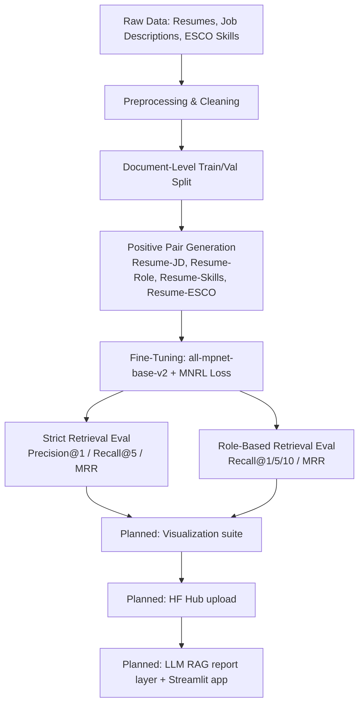

# Semantic Resume–Job Alignment Engine

> Fine-tuning a Sentence Transformer to learn joint embeddings for resumes, job descriptions, job titles, and skill sets — the retrieval backbone for a future AI-powered ATS matching system.

**Status: 🚧 Work in Progress** — this repo currently contains the embedding training pipeline only. See [Project Status & Roadmap](#project-status--roadmap) for exactly what's done and what isn't.

---

## Table of Contents
- [Overview](#overview)
- [Why This Project](#why-this-project)
- [Architecture](#architecture)
- [Dataset](#dataset)
- [Pipeline](#pipeline)
- [Results](#results)
- [Key Observations & Limitations](#key-observations--limitations)
- [Project Status & Roadmap](#project-status--roadmap)
- [Repo Structure](#repo-structure)
- [Getting Started](#getting-started)
- [Tech Stack](#tech-stack)
- [Acknowledgments](#acknowledgments)
- [License](#license)

---

## Overview

This project fine-tunes `sentence-transformers/all-mpnet-base-v2` to produce a shared embedding space where a candidate's **resume** sits close to its matching **job description**, **job title/role**, and **skill profile** — and far from unrelated ones. The training objective is **Multiple Negatives Ranking Loss (MNRL)**, an InfoNCE-style contrastive loss that treats the correct pairing in a batch as the positive and every other item in the batch as an implicit negative.

The long-term goal (see [Roadmap](#project-status--roadmap)) is a two-component ATS-style system:
1. **This repo — retrieval component:** a fine-tuned bi-encoder that ranks resumes against job requirements by semantic similarity.
2. **Planned — explanation component:** a lightweight instruction-tuned LLM (e.g. Gemma, Phi-3 Mini, Qwen2.5-Instruct) wired up via RAG to turn the retrieval scores into a human-readable ATS-style report, served through a Streamlit app.

Only component 1 exists right now, and it's still a work in progress.

## Why This Project

Most public "resume matcher" projects lean on keyword overlap or TF-IDF. This project instead trains a real semantic retrieval model end-to-end — data cleaning, contrastive pair construction, fine-tuning, and IR-style evaluation (Recall@K, MRR) — as a way to explore what it actually takes to build a defensible, evaluable embedding-based matching system, warts and all.

## Architecture



## Dataset

| Source | Size | Notes |
|---|---|---|
| Resume corpus | 29,780 resumes | Public Kaggle resume text corpus (`source:::keywords:::resume_text` format) |
| Job descriptions | 1,615,940 rows → 25,367 after filtering to tech roles | Public Kaggle job description dataset |
| ESCO skill taxonomy | 155 occupations | Hand-curated fallback dictionary — the notebook first tries to pull live ESCO datasets from the Hugging Face Hub (`jjzha/esco`, `mw4/esco-skills`, `TechWolf/ESCO-Skills`) and only falls back to this built-in table if none are reachable |

All three sources are cleaned, normalized (synonym + role normalization, unicode cleanup), and skill-extracted before pairing.

## Pipeline

1. **Environment setup** — pinned dependency versions for reproducible Colab runs.
2. **Config & seeding** — deterministic seeding across `random`, `numpy`, and `torch` (CPU + CUDA).
3. **Data loading** — fail-safe loaders for resumes/jobs/ESCO with automatic file-type detection.
4. **Preprocessing** — text cleaning, synonym normalization, role normalization, regex-based skill extraction, and experience/education/section extraction.
5. **Splitting & pair generation** — document-level train/val split, then positive pairs constructed as:
   - Resume ↔ predicted role
   - Resume ↔ extracted skill string
   - Resume ↔ ESCO skill string for that role
   - Resume ↔ up to 3 sampled job descriptions with matching role + ≥2 overlapping skills
6. **Fine-tuning** — `all-mpnet-base-v2` + `MultipleNegativesRankingLoss`, 1 epoch, batch size 16, on a Colab T4.
7. **Evaluation (two protocols)**:
   - A strict retrieval evaluator (1 correct document per query, ranked against all validation documents).
   - A role-based retrieval evaluator (a retrieval counts as correct if the top-ranked job shares the resume's predicted role).

## Results

| Metric | Strict Retrieval Eval | Role-Based Retrieval Eval |
|---|---|---|
| Queries evaluated | 2,172 | 2,172 |
| Mean cosine similarity | 0.4649 | – |
| Precision/Recall@1 | 0.0037 | 0.5649 |
| Recall@5 | 0.0226 | 0.5755 |
| Recall@10 | – | 0.5902 |
| MRR | 0.0201 | 0.5741 |

**Training run:** 55,050 positive pairs, 1 epoch, batch size 16 → ~3,441 training steps on a Tesla T4.

## Key Observations & Limitations

- **The two eval scores tell different stories, and that's expected, not a bug.** The strict evaluator only credits the model if it ranks the *exact* paired job description #1 out of 2,172 candidates — but many job postings for the same role are near-duplicates in wording, so the "correct" one often loses to an equally valid semantic match. The role-based evaluator (any job with the same predicted role counts) shows the model is clearly learning meaningful structure (Recall@1 ≈ 0.56). Read the strict numbers as an upper-bound-on-difficulty stress test, not the whole picture.
- **The training loop is currently the standard `SentenceTransformer.fit()` API**, not a custom PyTorch loop. An earlier design note in the notebook describes a fully custom, mixed-precision training loop — that hasn't been implemented yet and is tracked in the roadmap below.
- **Only 1 of the 3 configured epochs was actually run** for this checkpoint (the global config defines `EPOCHS = 3`, but the fine-tuning cell overrides it to `NUM_EPOCHS = 1` for a fast first pass). Multi-epoch runs haven't been benchmarked yet.
- **No hard-negative mining yet** — negatives are purely in-batch, which caps how discriminative the model can get between similar roles (e.g. "Data Analyst" vs. "Business Analyst").
- **ESCO knowledge base is a hand-built fallback**, not the live ESCO taxonomy — skill coverage is broad but not exhaustive.

## Project Status & Roadmap

This is an actively evolving project. Implemented so far:

- [x] Data loading, cleaning, and normalization pipeline
- [x] Positive pair generation (4 pairing strategies)
- [x] MNRL fine-tuning of `all-mpnet-base-v2`
- [x] Two independent retrieval evaluation protocols

Planned next:

- [ ] Replace `model.fit()` with a custom, mixed-precision PyTorch training loop
- [ ] Hard-negative mining to sharpen role-vs-role discrimination
- [ ] Multi-epoch training sweep + learning-rate/batch-size ablation
- [ ] Embedding space visualizations (similarity heatmaps, PCA/UMAP projections)
- [ ] Push fine-tuned checkpoint to the Hugging Face Hub
- [ ] Swap in the live ESCO taxonomy instead of the built-in fallback
- [ ] Component 2: instruction-tuned LLM (RAG) layer for explainable ATS reports
- [ ] Streamlit application wrapping both components

Issues and PRs on any of the above are welcome once the repo is public.

## Repo Structure

```
.
├── semantic_resume_alignment.ipynb   # Main training & evaluation notebook (this component)
├── README.md
└── LICENSE
```

## Getting Started

This notebook is built for **Google Colab** (it mounts Google Drive for data/model storage and expects a CUDA GPU runtime).

1. Open `semantic_resume_alignment.ipynb` in Colab.
2. Place your resume corpus, job description CSV, and (optionally) ESCO data under `MyDrive/SemanticResumeATS/datasets/` following the folder layout defined in the notebook's data-loading cells.
3. Run cells top to bottom. Dependency versions are pinned in the first cell for reproducibility.
4. The fine-tuned model is saved locally to `./resume_job_mpnet_finetuned` at the end of the fine-tuning cell.

> **Note:** Public datasets aren't bundled in this repo. Point the notebook at any resume-text corpus and job-description corpus in a compatible schema, or adapt the loader functions.

## Tech Stack

`Python` · `PyTorch` · `sentence-transformers` · `Hugging Face Hub` · `pandas` / `NumPy` · `scikit-learn` · `Google Colab`

## Acknowledgments

- [`sentence-transformers`](https://www.sbert.net/) for the MNRL training utilities and base model.
- [ESCO](https://esco.ec.europa.eu/) for the occupation/skills taxonomy concept.
- Public Kaggle resume and job-description datasets used for training data.
