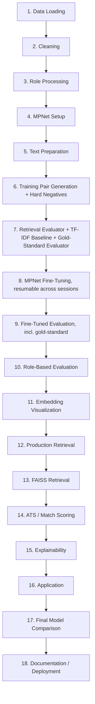
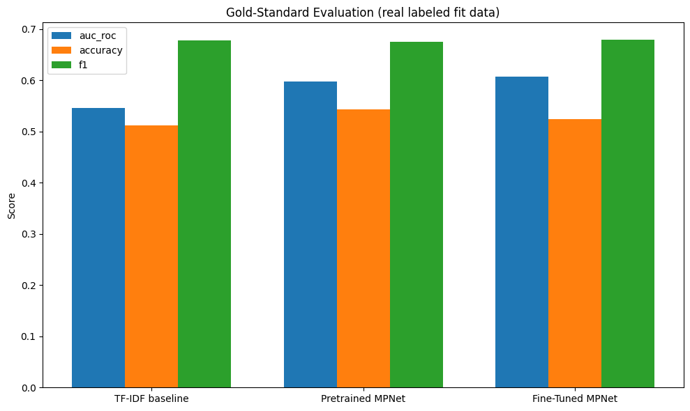

# Semantic Resume-Job Alignment & ATS Intelligence Pipeline

> An end-to-end pipeline that fine-tunes a Sentence Transformer to semantically match resumes to job postings, evaluated against both heuristic and REAL labeled ground truth, then layered with FAISS retrieval, rule-based ATS scoring, explainability, and a demo application.

**Status: 🚧 Incomplete / Work in Progress** — every module below runs end-to-end on real data, with a real 3-epoch training run completed. Most retrieval-quality problems from earlier iterations are fixed, but a real, honestly-documented regression showed up in this run too. See [Known Issues & Honest Limitations](#known-issues--honest-limitations).

---

## Table of Contents
- [Overview](#overview)
- [Why This Project](#why-this-project)
- [Architecture](#architecture)
- [Dataset](#dataset)
- [Pipeline: All 18 Modules](#pipeline-all-18-modules)
- [Results](#results)
- [Visualizations](#visualizations)
- [ATS Scoring & Explainability Demo](#ats-scoring--explainability-demo)
- [Known Issues & Honest Limitations](#known-issues--honest-limitations)
- [Project Status & Roadmap](#project-status--roadmap)
- [Repo Structure](#repo-structure)
- [Getting Started](#getting-started)
- [Uploading Result Images](#uploading-result-images)
- [Tech Stack](#tech-stack)
- [Acknowledgments](#acknowledgments)
- [License](#license)

---

## Overview

This project fine-tunes `sentence-transformers/all-mpnet-base-v2` to place resumes, job descriptions, job titles, and skill profiles in a shared embedding space, then builds a small ATS-style system on top of it:

1. **Retrieval** — a fine-tuned bi-encoder + FAISS index that ranks resumes against jobs by semantic similarity.
2. **ATS scoring** — a composite, interpretable 0-100 score combining semantic similarity, skill coverage, experience match, and role match.
3. **Explainability** — plain-language, rule-based explanations plus a leave-one-out skill-importance analysis (no LLM involved).
4. **Application layer** — a callable end-to-end pipeline and an interactive notebook demo.

Unlike earlier iterations, this version is evaluated against **real, human/algorithmically labeled ground truth** (`cnamuangtoun/resume-job-description-fit`, 8,000 resume&harr;job pairs), not just a role-matching proxy this notebook constructs itself. On that gold-standard test, and on the notebook's own strict retrieval test, **fine-tuning clearly and measurably outperforms both a TF-IDF baseline and the untrained base model** — see [Results](#results).

## Why This Project

Most public "resume matcher" repos use keyword overlap or TF-IDF. This project instead builds and *evaluates* a real semantic retrieval system end-to-end — data cleaning, contrastive pair construction, hard-negative mining, fine-tuning, multiple independent evaluation protocols (including one against real labels), a production retrieval interface, ATS-style scoring, and explainability.

## Architecture



## Dataset

| Source | Size | Notes |
|---|---|---|
| Resume corpus | 29,780 resumes | Public Kaggle resume text corpus |
| Job descriptions | 123,849 raw &rarr; 18,658 after tech-role filtering &rarr; **17,247 after deduplication** | [`arshkon/linkedin-job-postings`](https://www.kaggle.com/datasets/arshkon/linkedin-job-postings) (real, individually scraped 2023-2024 LinkedIn postings) |
| Gold-standard fit labels | 6,241 train / 1,759 test | [`cnamuangtoun/resume-job-description-fit`](https://huggingface.co/datasets/cnamuangtoun/resume-job-description-fit) -- real Good Fit / Potential Fit / No Fit labels, used as the primary evaluation |
| ESCO skill taxonomy | 155 occupations | Built-in fallback dictionary -- live ESCO datasets on the Hugging Face Hub were attempted first and were not reachable |

**1,411 duplicate job postings (7.6% of the tech-filtered set) were removed** before any pairing or evaluation happened -- this directly fixes a bug from an earlier iteration where the same job posting appeared many times in a single top-10 result.

## Pipeline: All 18 Modules

| # | Module | What it does | Key output |
|---|---|---|---|
| 1 | Data Loading | Loads resumes, LinkedIn jobs, ESCO knowledge base, gold-standard fit dataset | 29,780 resumes, 123,849 jobs, 155 ESCO occupations, 8,000 labeled pairs |
| 2 | Cleaning | Text cleaning, LinkedIn-schema column mapping, experience-level mapping, deduplication | 17,247 clean jobs; 329-skill vocabulary |
| 3 | Role Processing | Normalizes free-text roles onto the ESCO vocabulary; assigns each resume a `predicted_role` | 98.9% of resumes got a resolved role |
| 4 | MPNet Setup | Loads the pretrained `all-mpnet-base-v2` base model, applies `MAX_SEQ_LENGTH=256` | 768-dimensional embedding space |
| 5 | Text Preparation | Document-level train/validation split | 23,824 train / 5,956 validation resumes |
| 6 | Training Pair Generation | Builds positive pairs, rebalanced toward resume&harr;JD pairs, mines hard negatives | **79,415 training pairs, 64% resume&harr;JD**; 15,000 hard negatives mined |
| 7 | Retrieval Evaluator | Duplicate-aware evaluator + TF-IDF baseline + gold-standard evaluator | 3,900 validation queries; gold-standard label distribution logged |
| 8 | MPNet Fine-Tuning | Resumable, one epoch per session, checkpoints on Google Drive, mixed precision | **All 3 configured epochs completed**, resumed correctly across sessions |
| 9 | Fine-Tuned Evaluation | Compares pretrained vs. TF-IDF vs. fine-tuned, on both the strict proxy AND gold-standard sets | See [Results](#results) -- fine-tuning wins on both |
| 10 | Role-Based Evaluation | A looser evaluation: does the top result share the resume's role? | Recall@1 = 0.194 (see [Known Issues](#known-issues--honest-limitations)) |
| 11 | Embedding Visualization | Similarity heatmap + PCA projection | See [Visualizations](#visualizations) |
| 12 | Production Retrieval | `ResumeJobMatcher` -- cached, brute-force top-K retrieval interface | ~33ms/query on 3,450 jobs |
| 13 | FAISS Retrieval | `FaissResumeJobMatcher` -- same interface, FAISS-backed | ~23ms/query, 10/10 overlap with brute-force |
| 14 | ATS / Match Scoring | Composite 0-100 score: 50% semantic + 30% skills + 10% experience + 10% role | See [ATS Demo](#ats-scoring--explainability-demo) |
| 15 | Explainability | Rule-based match explanation + leave-one-out skill importance | No LLM used |
| 16 | Application | `run_ats_pipeline()` end-to-end callable + `ipywidgets` demo UI | Working demo |
| 17 | Final Model Comparison | Aggregates every metric into one table + chart per evaluation type | See [Results](#results) |
| 18 | Documentation / Deployment | Generates a model card, run manifest, and a reference (unexecuted) FastAPI skeleton | Not a live deployment |

## Results

### The headline result: fine-tuning clearly works, on two independent tests

**Strict retrieval evaluation** (does the model rank a resume's one true matching job description first?):

| Metric | TF-IDF baseline | Pretrained MPNet | Fine-Tuned MPNet |
|---|---|---|---|
| Precision@1 | 0.052 | 0.086 | **0.141** |
| Recall@5 | 0.056 | 0.089 | **0.150** |
| MRR | 0.058 | 0.092 | **0.152** |
| nDCG@5 | 0.054 | 0.087 | **0.145** |

Fine-tuning roughly **doubles** every metric over the pretrained model, and beats TF-IDF by an even wider margin -- a clean, unambiguous win, unlike an earlier iteration of this project where the fine-tuned model barely matched a keyword-overlap baseline.

**Gold-standard evaluation** (real human/algorithmic fit labels, held-out test set):

| Metric | TF-IDF baseline | Pretrained MPNet | Fine-Tuned MPNet |
|---|---|---|---|
| AUC-ROC | 0.547 | 0.598 | **0.607** |
| Accuracy | 0.513 | **0.544** | 0.524 |
| F1 | 0.678 | 0.676 | **0.679** |
| Precision | 0.513 | **0.532** | 0.519 |
| Recall | **1.000** | 0.927 | 0.982 |

Fine-tuning wins on AUC-ROC (the threshold-independent, most meaningful metric here) and F1, but **accuracy and precision actually dipped slightly versus the pretrained model.** This is a real, honestly-reported nuance -- see [Known Issues](#known-issues--honest-limitations).

### Role-based evaluation: a real regression, with a likely explanation

| Role-based evaluation (Module 10) | This run | Previous run (older dataset) |
|---|---|---|
| Recall@1 | **0.194** | 0.564 |
| Recall@5 | 0.401 | 0.571 |
| MRR | 0.291 | 0.571 |

This number dropped substantially. It is **not** dismissed here -- see [Known Issues](#known-issues--honest-limitations) for the likely cause and why it doesn't necessarily mean retrieval quality got worse.

### Retrieval latency (3,450-document validation job corpus)

| System | Mean | P95 |
|---|---|---|
| Brute-force (NumPy) | 32.52 ms/query | 55.43 ms/query |
| FAISS (`IndexFlatIP`) | 23.21 ms/query | 29.33 ms/query |

FAISS and brute-force retrieval agreed on **10/10** top results (previously only 2/10, before job deduplication was fixed).

## Visualizations

### Resume &harr; Job Similarity Heatmap

A sampled block of resumes vs. jobs, with role-matching cells outlined in red.


### PCA Projection of the Embedding Space

Job postings (triangles) for the most frequent roles, colored, against a faded background of everything else.


### Strict Retrieval System Comparison

TF-IDF, pretrained MPNet, and fine-tuned MPNet on the strict evaluation -- a clean staircase, fine-tuning winning on every metric.


### Gold-Standard Evaluation Comparison

The same three systems against real labeled fit data.




## ATS Scoring & Explainability Demo

A real example from this run's validation output. A `PL/SQL Developer`-adjacent resume was retrieved and scored:

**Module 14 (ATS Scoring)** -- top-ranked candidate:

| Rank | Job | ATS Score | Semantic | Skills | Experience | Role Match |
|---|---|---|---|---|---|---|
| 1 | PL/SQL Developer | **52.9** | 0.408 | 0.75 | 1.00 | ❌ |

**Module 15 (Explainability)** -- generated explanation for this match:
> Overall ATS match score: 52.9/100. Matched skills (6): agile, communication, oracle, performance tuning, scrum, sql. Skills the job asks for but the resume doesn't list (2): functions, pl/sql. Experience meets the posting's requirement. Role: the resume's predicted role doesn't exactly match this job's normalized role, though the underlying content may still be relevant.

**Leave-one-out skill importance** for this match:

| Skill | Similarity drop if removed |
|---|---|
| scrum | +0.0173 |
| sql | +0.0146 |
| business process | +0.0096 |
| reporting | +0.0077 |
| agile | +0.0020 |

Worth noting honestly: the top-ranked candidate did **not** share the resume's predicted role, which ties directly into the role-based evaluation issue below.

## Known Issues & Honest Limitations

This project is shared in its current, imperfect state on purpose.

1. **Role-based Recall@1 dropped from 0.564 (previous dataset) to 0.194 (this run) -- likely a metric artifact from switching to messier, real-world job titles, not necessarily a retrieval-quality regression.** The role-based evaluator requires an *exact string match* between a resume's predicted role and a job's normalized role. LinkedIn's real job titles are far more granular than the previous dataset's ("DevOps Engineer" vs. "Sr. DevOps Engineer" vs. "Lead DevOps Engineer" all normalize to different strings). The similarity heatmap actually shows this directly: a DevOps Engineer resume's single highest-similarity match in its entire sampled row is a "Sr. DevOps Engineer" posting -- a clearly excellent match -- but it isn't credited by the role-based metric because the strings don't match exactly. This needs a fix (normalizing away seniority prefixes/suffixes before comparing), not just an explanation.
2. **On the gold-standard evaluation, accuracy and precision dipped slightly versus the pretrained model, even though AUC-ROC and F1 improved.** Recall is very high across all three systems (0.93-1.0), meaning the classification threshold (tuned on the train split) leans toward predicting "Fit" often. AUC-ROC is threshold-independent and the more meaningful number here, but the accuracy dip is real and worth investigating rather than glossing over.
3. **The environment-setup pip install cell threw a metadata-generation error for one pinned package** during this run (the install proceeded regardless, and nothing downstream failed, but the specific package was not identified due to the quiet install flag). Worth cleaning up so failures aren't silently swallowed.
4. **Mean cosine similarity dropped after fine-tuning (0.345 vs. 0.592 pretrained).** This is expected, not a bug -- contrastive fine-tuning typically spreads embeddings out and makes similarity scores more discriminative (better *ranking*), which can lower raw similarity magnitudes. All the ranking metrics (Precision@1, MRR, nDCG) improved substantially, which is what actually matters.
5. **ESCO skill taxonomy uses a 155-occupation fallback dictionary, not the full live taxonomy.**
6. **Hard negatives were only mined for resume&harr;job pairs**, not for role/skill pairs.
7. **Explainability (Module 15) is rule-based and embedding-based, not LLM-based.**
8. **ATS scoring weights (Module 14) are a reasonable starting point, not an industry-validated formula.**
9. **The gold-standard dataset (8,000 pairs) is much smaller than the training corpus** -- it's a trustworthy *test*, not a training replacement.

**Bottom line:** the two most important, most trustworthy evaluations in this notebook (strict retrieval, and real-label gold-standard) both show fine-tuning clearly beating baselines -- a genuine improvement over an earlier iteration where that wasn't true. The role-based metric regression is real and reported honestly, with a specific, plausible, and fixable cause identified rather than hidden.

## Project Status & Roadmap

Implemented, running end-to-end, and evaluated on real data:

- [x] LinkedIn job dataset with real deduplication (Modules 1-2)
- [x] Gold-standard labeled evaluation, replacing pure heuristic proxies (Modules 1, 7, 9, 17)
- [x] Rebalanced training pairs (64% resume&harr;JD, up from ~20%) (Module 6)
- [x] Fully resumable fine-tuning across Colab sessions, all 3 epochs completed (Module 8)
- [x] Fine-tuning clearly beats TF-IDF and pretrained baselines on two independent evaluations (Module 9)
- [x] FAISS retrieval with correct (10/10) agreement against brute-force (Module 13)
- [x] ATS scoring, explainability, and a working demo app (Modules 14-16)

Known fixes needed next:

- [ ] Normalize seniority prefixes/suffixes (Sr., Lead, Jr., II, III) before role-matching comparisons, and re-run Module 10
- [ ] Investigate the gold-standard accuracy/precision dip -- try alternate thresholding strategies (e.g. optimizing for accuracy or a fixed precision target instead of F1)
- [ ] Identify and either fix or remove the pip package causing a silent metadata-generation error during setup
- [ ] Re-run Module 10 after the role-normalization fix and confirm whether the "regression" was purely a metric artifact

Further out:

- [ ] Hard-negative mining for role/skill pair types
- [ ] Swap the built-in ESCO fallback for the live taxonomy
- [ ] An LLM/RAG-based explanation layer
- [ ] A deployed application wrapping the FastAPI skeleton already generated in Module 18

## Repo Structure

```
.
├── semantic_resume_alignment.ipynb   # Full 18-module pipeline notebook
├── assets/
│   ├── similarity_heatmap.png        # Module 11 output
│   ├── pca_projection.png            # Module 11 output
│   ├── system_comparison.png         # Module 17 output (strict eval)
│   └── gold_standard_comparison.png  # Module 17 output (gold-standard eval)
├── README.md
└── requirements.txt
```

## Getting Started

Built for **Google Colab** (mounts Google Drive, expects a CUDA GPU runtime -- tested on the free-tier T4).

1. Open `semantic_resume_alignment.ipynb` in Colab.
2. Download `postings.csv` from [`arshkon/linkedin-job-postings`](https://www.kaggle.com/datasets/arshkon/linkedin-job-postings) on Kaggle and place it at `MyDrive/SemanticResumeATS/datasets/jobs_linkedin/postings.csv`.
3. Place your resume corpus at the path used in Module 1's loader.
4. The gold-standard fit dataset downloads automatically from the Hugging Face Hub -- no manual step needed.
5. Run cells top to bottom. **Module 8 (fine-tuning) trains one epoch per execution** and checkpoints to Google Drive -- if your session disconnects, just re-run that same cell; it resumes automatically instead of starting over.

> **Public datasets aren't bundled in this repo.** Point the notebook at any resume-text corpus and job-description corpus in a compatible schema, or adapt the loader functions.

## Tech Stack

`Python` &middot; `PyTorch` &middot; `sentence-transformers` &middot; `FAISS` &middot; `Hugging Face Hub` &middot; `pandas` / `NumPy` &middot; `scikit-learn` &middot; `Google Colab` &middot; `ipywidgets`

## Acknowledgments

- [`sentence-transformers`](https://www.sbert.net/) for the MNRL training utilities and base model.
- [FAISS](https://github.com/facebookresearch/faiss) for the approximate nearest-neighbor retrieval index.
- [ESCO](https://esco.ec.europa.eu/) for the occupation/skills taxonomy concept.
- [`arshkon/linkedin-job-postings`](https://www.kaggle.com/datasets/arshkon/linkedin-job-postings) and the public Kaggle resume corpus for training data.
- [`cnamuangtoun/resume-job-description-fit`](https://huggingface.co/datasets/cnamuangtoun/resume-job-description-fit) for gold-standard labeled evaluation data.
