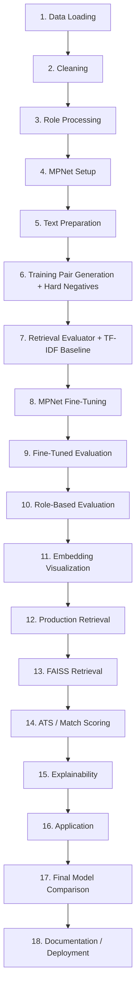
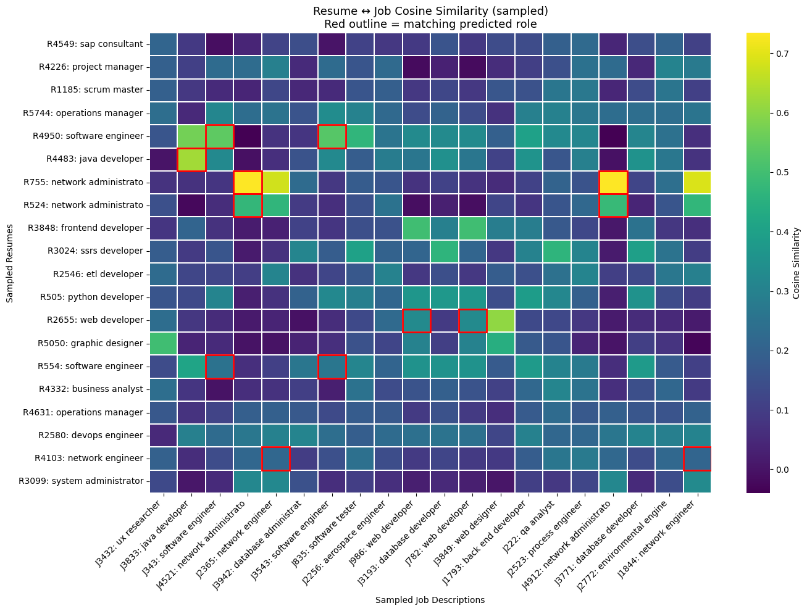
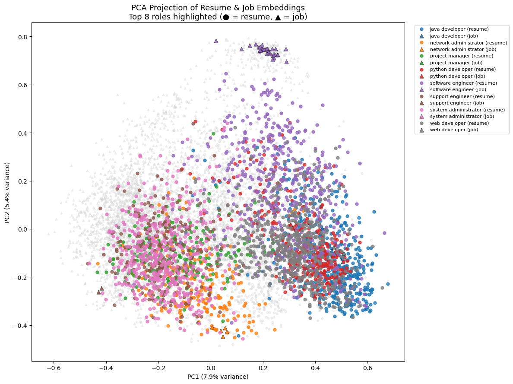
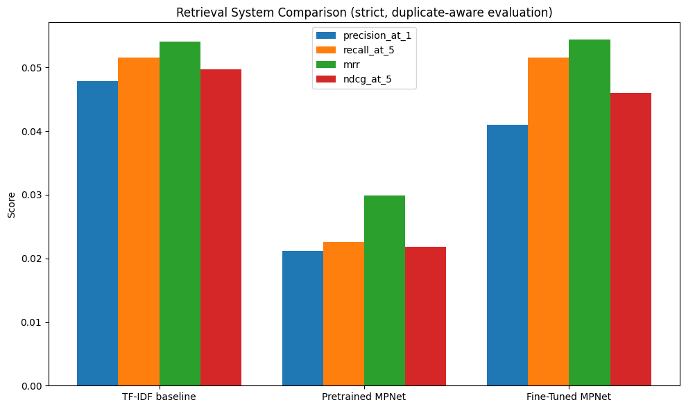

# Semantic Resume-Job Alignment & ATS Intelligence Pipeline

> An end-to-end pipeline that fine-tunes a Sentence Transformer to semantically match resumes to job postings, then layers rule-based ATS scoring, explainability, and a demo application on top — built and evaluated module by module, with the honest results (good and bad) documented below.

**Status: 🚧 Incomplete / Work in Progress** — every module below runs end-to-end on real data, but the retrieval quality has known issues that are not yet fixed (see [Known Issues & Honest Limitations](#known-issues--honest-limitations)). This is shared to show active, in-progress work, not as a finished system.

---

## Table of Contents
- [Overview](#overview)
- [Why This Project](#why-this-project)
- [Architecture](#architecture)
- [Dataset](#dataset)
- [Pipeline: All 18 Modules](#pipeline-all-18-modules)
- [Results](#results)
- [Visualizations](#visualizations)
- [ATS Scoring & Explainability Demo](#ats-scoring--explainability-demo)
- [Known Issues & Honest Limitations](#known-issues--honest-limitations)
- [Project Status & Roadmap](#project-status--roadmap)
- [Repo Structure](#repo-structure)
- [Getting Started](#getting-started)
- [Uploading Result Images](#uploading-result-images)
- [Tech Stack](#tech-stack)
- [Acknowledgments](#acknowledgments)
- [License](#license)

---

## Overview

This project fine-tunes `sentence-transformers/all-mpnet-base-v2` to place resumes, job descriptions, job titles, and skill profiles in a shared embedding space, then builds a small ATS-style system on top of it:

1. **Retrieval** — a fine-tuned bi-encoder + FAISS index that ranks resumes against jobs by semantic similarity.
2. **ATS scoring** — a composite, interpretable 0-100 score combining semantic similarity, skill coverage, experience match, and role match.
3. **Explainability** — plain-language, rule-based explanations plus a leave-one-out skill-importance analysis (no LLM involved).
4. **Application layer** — a callable end-to-end pipeline and an interactive notebook demo.

All 18 planned modules exist and run successfully end-to-end on real data (29,780 resumes, 1.6M+ job postings). **The retrieval quality itself is not yet where it needs to be** — see [Known Issues](#known-issues--honest-limitations) for a fully transparent breakdown of what's wrong and why.

## Why This Project

Most public "resume matcher" repos use keyword overlap or TF-IDF. This project instead builds and *evaluates* a real semantic retrieval system end-to-end — data cleaning, contrastive pair construction, hard-negative mining, fine-tuning, multiple independent evaluation protocols, a production retrieval interface, ATS-style scoring, and explainability — as a way to learn what it actually takes to build (and honestly evaluate) an embedding-based matching system.

## Architecture



## Dataset

| Source | Size | Notes |
|---|---|---|
| Resume corpus | 29,780 resumes | Public Kaggle resume text corpus |
| Job descriptions | 1,615,940 rows &rarr; 25,367 after tech-role filtering | Public Kaggle job description dataset |
| ESCO skill taxonomy | 155 occupations | Built-in fallback dictionary -- live ESCO datasets on the Hugging Face Hub were attempted first and were not reachable, so the pipeline fell back automatically |

## Pipeline: All 18 Modules

| # | Module | What it does | Key output |
|---|---|---|---|
| 1 | Data Loading | Loads resumes, jobs, and the ESCO knowledge base | 29,780 resumes, 1.6M jobs, 155 ESCO occupations |
| 2 | Cleaning | Text cleaning, abbreviation normalization, regex skill extraction | 25,367 tech jobs after filtering; 329-skill vocabulary |
| 3 | Role Processing | Normalizes free-text roles onto the ESCO vocabulary; assigns each resume a `predicted_role` | 98.9% of resumes got a resolved role |
| 4 | MPNet Setup | Loads the pretrained `all-mpnet-base-v2` base model | 768-dimensional embedding space |
| 5 | Text Preparation | Document-level train/validation split | 23,824 train / 5,956 validation resumes |
| 6 | Training Pair Generation | Builds positive pairs (Resume&harr;Role, Resume&harr;Skills, Resume&harr;ESCO-skills, Resume&harr;JD) + mines hard negatives via TF-IDF nearest neighbors | 53,385 training pairs; 6,580 mined hard negatives |
| 7 | Retrieval Evaluator | Builds a duplicate-aware evaluator (a documented bug fix from an earlier version) + a TF-IDF baseline | 2,171 validation queries |
| 8 | MPNet Fine-Tuning | Fine-tunes with `MultipleNegativesRankingLoss`, checkpointing every quarter-epoch | Trained for **1 epoch** (see limitations) |
| 9 | Fine-Tuned Evaluation | Compares pretrained vs. TF-IDF vs. fine-tuned on the identical validation set | See [Results](#results) |
| 10 | Role-Based Evaluation | A looser evaluation: does the top result share the resume's role? | Recall@1 = 0.56 |
| 11 | Embedding Visualization | Similarity heatmap + PCA projection of the embedding space | See [Visualizations](#visualizations) |
| 12 | Production Retrieval | `ResumeJobMatcher` -- cached, brute-force top-K retrieval interface | ~50ms/query on 5,074 jobs |
| 13 | FAISS Retrieval | `FaissResumeJobMatcher` -- same interface, FAISS-backed | ~45ms/query (see caveat in limitations) |
| 14 | ATS / Match Scoring | Composite 0-100 score: 50% semantic + 30% skills + 10% experience + 10% role | See [ATS Demo](#ats-scoring--explainability-demo) |
| 15 | Explainability | Rule-based match explanation + leave-one-out skill importance | No LLM used |
| 16 | Application | `run_ats_pipeline()` end-to-end callable + optional `ipywidgets` demo UI | Working demo |
| 17 | Final Model Comparison | Aggregates every metric from Modules 9/10/12/13 into one table + chart | See [Results](#results) |
| 18 | Documentation / Deployment | Generates a model card, run manifest, and a reference (unexecuted) FastAPI skeleton | Not a live deployment |

## Results

The single most important thing to understand about this project's current state: **on the strict evaluation (does the model rank a resume's one true matching job description first?), the fine-tuned model is barely different from a simple keyword-matching (TF-IDF) baseline.**

| Metric | TF-IDF baseline (no AI) | Pretrained MPNet (untuned) | Fine-Tuned MPNet |
|---|---|---|---|
| Precision@1 | 0.048 | 0.021 | 0.041 |
| Recall@5 | 0.052 | 0.023 | 0.052 |
| MRR | 0.054 | 0.030 | **0.054** |
| nDCG@5 | 0.050 | 0.022 | 0.046 |

Fine-tuning clearly beats the untrained base model, and edges out TF-IDF on MRR/Recall@5 -- but loses to TF-IDF on Precision@1 and nDCG@5. This is not a strong "fine-tuning works" result yet. See [Known Issues](#known-issues--honest-limitations) for why, and what would need to change.

**However**, a looser, more realistic evaluation tells a better story:

| Role-based evaluation (Module 10) | Score |
|---|---|
| Recall@1 | 0.5638 |
| Recall@5 | 0.5707 |
| Recall@10 | 0.5831 |
| MRR | 0.5713 |
| nDCG@5 | 0.5669 |

Over half the time, the single top-ranked job for a resume shares that resume's correct role -- a genuinely meaningful signal that the model learned real structure, even if it isn't yet precise enough to win the stricter, exact-document test above.

**Retrieval latency** (5,074-document validation job corpus):

| System | Mean | P95 |
|---|---|---|
| Brute-force (NumPy) | 50.49 ms/query | 73.53 ms/query |
| FAISS (`IndexFlatIP`) | 44.91 ms/query | 61.75 ms/query |

## Visualizations

### Resume &harr; Job Similarity Heatmap

A sampled block of resumes vs. jobs, with role-matching cells outlined in red.



### PCA Projection of the Embedding Space

Job postings (triangles) form tight, visually distinct clusters by role -- a strong positive sign about what the model learned, even though the strict retrieval metric above doesn't yet fully reflect it.



### System Comparison Chart

TF-IDF, pretrained MPNet, and fine-tuned MPNet, side by side, on the strict evaluation from the Results table above.




## ATS Scoring & Explainability Demo

A real example from a validation run, worth including because it honestly shows both a retrieval weakness and how the downstream ATS layer partially corrects for it.

**Raw semantic retrieval** for a Java Developer resume (Module 12) put an unrelated, duplicated job posting *above* the correct one:

```
Rank 1-9:  Process Engineer   (score 0.4371 -- identical, duplicated posting)
Rank 10:   Java Developer     (score 0.4321)
```

**After ATS scoring** (Module 14), which factors in skill overlap and role match on top of raw similarity, the ranking corrects itself:

| Rank | Job | ATS Score | Semantic | Skills | Role Match |
|---|---|---|---|---|---|
| 1 | Java Developer | **51.6** | 0.432 | 0.33 | ✅ |
| 2-10 | Process Engineer (duplicated) | 31.9 | 0.437 | 0.00 | ❌ |

**Explanation generated by Module 15** for the top match:
> Overall ATS match score: 51.6/100. Matched skills (1): java. Skills the job asks for but the resume doesn't list (2): git, security. Experience meets the posting's requirement. Role: the resume's predicted role matches this job's role exactly.

This is a genuinely encouraging result: layering interpretable scoring on top of raw embeddings recovered a correct ranking that pure semantic similarity got wrong on its own.

## Known Issues & Honest Limitations

This project is being shared in its current, imperfect state on purpose. Here's what's actually wrong, in order of impact:

1. **Job postings were never deduplicated.** Unlike resumes (which are deduplicated in Module 2), the job dataset still contains many exact-duplicate postings. This is why the demo retrieval above returned the *same* "Process Engineer" posting nine times in a top-10 list -- it's not nine different opportunities, it's one posting counted nine times. This likely also distorts the strict evaluation metrics in the Results table above.
2. **The model was only fine-tuned for 1 epoch**, not the 3 configured in the pipeline. With 53,385 training pairs, one pass is probably not enough for the model to fully learn the task, which is a likely contributor to the weak margin over the TF-IDF baseline.
3. **Only ~20% of training pairs are actual resume-to-job-description pairs** (10,494 of 53,385) -- the rest are shorter resume-to-role-name and resume-to-skill-list pairs. The strict evaluation tests exclusively on full job-description text, so there's a mismatch between most of what the model was trained on and what it's being tested on. This is a plausible explanation for why role-based accuracy (Module 10) is strong while exact-document accuracy (Module 9) is weak.
4. **The FAISS-vs-brute-force overlap check in Module 13 showed only 2/10 instead of the expected ~10/10.** This is not a FAISS bug -- it's a direct symptom of issue #1: when most of the "top 10" results are copies of the same duplicated posting, the overlap comparison (which compares by unique text) collapses to a much smaller effective set.
5. **ATS scoring weights (Module 14) are a reasonable starting guess, not a validated formula.** There's no universal ATS scoring standard to benchmark against.
6. **Explainability (Module 15) is rule-based, not LLM-based.** A planned future component (see Roadmap) would add a language-model layer for richer, more natural explanations.

**Bottom line:** the pipeline is real, runs end-to-end, and produces some genuinely meaningful results (role-level clustering, the ATS-layer correction example above) -- but the headline claim of "fine-tuning improves resume-job matching" is not yet clearly proven, mainly due to issues #1-#3, which are all fixable and already understood.

## Project Status & Roadmap

Implemented and running end-to-end:

- [x] Full data pipeline: loading, cleaning, role processing (Modules 1-3)
- [x] Fine-tuning pipeline with hard-negative mining (Modules 4-8)
- [x] Three independent evaluation protocols + baselines (Modules 7, 9, 10)
- [x] Embedding visualizations (Module 11)
- [x] Production retrieval, brute-force and FAISS-backed (Modules 12-13)
- [x] ATS scoring, explainability, and a working demo app (Modules 14-16)
- [x] Final comparison reporting and a generated model card (Modules 17-18)

Known fixes needed next (see [Known Issues](#known-issues--honest-limitations) for detail):

- [ ] Deduplicate job postings by text before splitting/pairing
- [ ] Re-run fine-tuning for the full configured epoch count
- [ ] Rebalance or oversample resume&harr;job-description pairs during training
- [ ] Re-evaluate after the above and confirm whether fine-tuning then clearly beats the TF-IDF baseline

Further out:

- [ ] Hard-negative mining for role/skill/ESCO pair types (currently JD pairs only)
- [ ] Swap the built-in ESCO fallback for the live taxonomy
- [ ] An LLM/RAG-based explanation layer (Component 2 of the original two-part system design)
- [ ] A deployed application (Streamlit or similar) wrapping the FastAPI skeleton already generated in Module 18

## Repo Structure

```
.
├── semantic_resume_alignment.ipynb   # Full 18-module pipeline notebook
├── assets/
│   ├── similarity_heatmap.png        # Module 11 output
│   ├── pca_projection.png            # Module 11 output
│   └── system_comparison.png         # Module 17 output
├── README.md
```

## Getting Started

Built for **Google Colab** (mounts Google Drive, expects a CUDA GPU runtime).

1. Open `semantic_resume_alignment.ipynb` in Colab.
2. Place your resume corpus, job description CSV, and (optionally) ESCO data under `MyDrive/SemanticResumeATS/datasets/` following the paths used in the data-loading cells.
3. Run cells top to bottom. The `!pip install` cells are unpinned or lightly pinned -- check output for any resolution errors before continuing.
4. Given the fine-tuning step alone took a meaningful amount of time even at 1 epoch, budget extra time (or use Colab Pro) if you increase `EPOCHS`.

> **Public datasets aren't bundled in this repo.** Point the notebook at any resume-text corpus and job-description corpus in a compatible schema, or adapt the loader functions.

## Tech Stack

`Python` &middot; `PyTorch` &middot; `sentence-transformers` &middot; `FAISS` &middot; `Hugging Face Hub` &middot; `pandas` / `NumPy` &middot; `scikit-learn` &middot; `Google Colab` &middot; `ipywidgets`

## Acknowledgments

- [`sentence-transformers`](https://www.sbert.net/) for the MNRL training utilities and base model.
- [FAISS](https://github.com/facebookresearch/faiss) for the approximate nearest-neighbor retrieval index.
- [ESCO](https://esco.ec.europa.eu/) for the occupation/skills taxonomy concept.
- Public Kaggle resume and job-description datasets used for training data.
